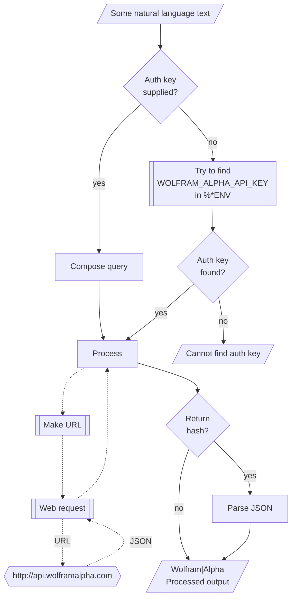

# WWW::WolframAlpha

## In brief

This Raku package provides access to the service [Wolfram|Alpha](https://www.wolframalpha.com), [WA1].
For more details of the Wolfram|Alpha's API usage see [the documentation](https://products.wolframalpha.com/api/documentation), [WA2].

**Remark:** To use the Wolfram|Alpha API one has to register and obtain an authorization key.


-----

## Installation

Package installations from both sources use [zef installer](https://github.com/ugexe/zef)
(which should be bundled with the "standard" Rakudo installation file.)

To install the package from [Zef ecosystem](https://raku.land/) use the shell command:

```
zef install WWW::WolframAlpha
```

To install the package from the GitHub repository use the shell command:

```
zef install https://github.com/antononcube/Raku-WWW-WolframAlpha.git
```

----

## Usage examples

**Remark:** When the authorization key, `auth-key`, is specified to be `Whatever`
then the function `wolfam-alpha` attempt to use the env variable `WOLFRAM_ALPHA_API_KEY`.

The package has an universal "front-end" function `wolfram-alpha` for the 
[different endpoints provided by Wolfram|Alpha Web API](https://products.wolframalpha.com/api/documentation).

### (Plaintext) results

Here is a _result_ call:

```perl6
use WWW::WolframAlpha;
wolfram-alpha-result('How many calories in 4 servings of potato salad?');
```

### Simple (image) results

Here is a _simple_ call (produces and image):

```perl6, results=asis
wolfram-alpha-simple('What is popularity of the name Larry?', format => 'md-image');
```

### Full queries

For the so called full queries Wolfram|Alpha returns complicated data of pods in either XML or JSON format;
see ["Explanation of Pods"](https://products.wolframalpha.com/api/documentation?scrollTo=explanation-of-pods).

Here we get W|A query result and its (complicated) data type (using ["Data::TypeSystem"](https://raku.land/zef:antononcube/Data::TypeSystem)):

```perl6
use Data::TypeSystem;

my $podRes = wolfram-alpha-query('convert 44 lbs to kilograms', output => 'json', format => 'hash');

deduce-type($podRes)
```

Here we convert the query result into Markdown (`data-translation` can be also used):

```perl6, results=asis
wolfram-alpha-pods-to-markdown($podRes, header-level => 4):plaintext;
```

-------

## Command Line Interface

### Playground access

The package provides a Command Line Interface (CLI) script:

```shell
wolfram-alpha --help
```


**Remark:** When the authorization key argument "auth-key" is specified set to "Whatever"
then `wolfram-alpha` attempts to use the env variable `WOLFRAM_ALPHA_API_KEY`.


--------

## Mermaid diagram

The following flowchart corresponds to the steps in the package function `wolfram-alpha-query`:



--------

## References

[WA1] Wolfram Alpha, [Wolfram|Alpha](https://www.wolframalpha.com). 

[WA2] Wolfram Alpha, [Web API documentation](https://products.wolframalpha.com/api/documentation). 