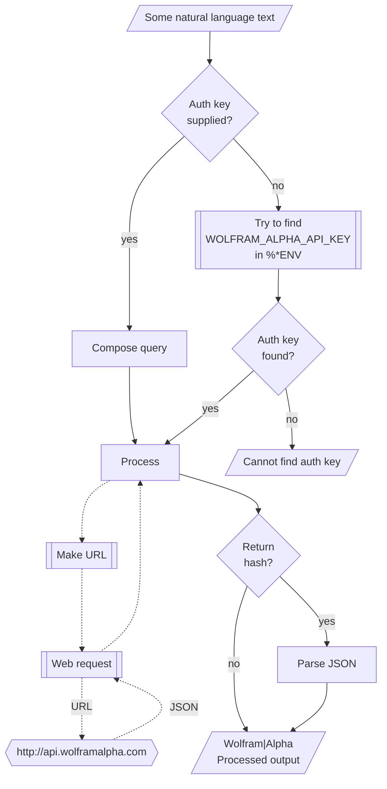

# WWW::WolframAlpha

## In brief

This Raku package provides access to the service [Wolfram|Alpha](https://www.wolframalpha.com), [WA1].
For more details of the Wolfram|Alpha's API usage see [the documentation](https://products.wolframalpha.com/api/documentation), [WA2].

**Remark:** To use the Wolfram|Alpha API one has to register and obtain an authorization key.


-----

## Installation

Package installations from both sources use [zef installer](https://github.com/ugexe/zef)
(which should be bundled with the "standard" Rakudo installation file.)

To install the package from [Zef ecosystem](https://raku.land/) use the shell command:

```
zef install WWW::WolframAlpha
```

To install the package from the GitHub repository use the shell command:

```
zef install https://github.com/antononcube/Raku-WWW-WolframAlpha.git
```

----

## Usage examples

**Remark:** When the authorization key, `auth-key`, is specified to be `Whatever`
then the function `wolfam-alpha` attempt to use the env variable `WOLFRAM_ALPHA_API_KEY`.

The package has an universal "front-end" function `wolfram-alpha` for the 
[different endpoints provided by Wolfram|Alpha Web API](https://products.wolframalpha.com/api/documentation).

Here is a _result_ call:

```perl6
use WWW::WolframAlpha;
wolfram-alpha-result('How many calories in 4 servings of potato salad?');
```
```
# about 720 dietary Calories
```

Here is a _simple_ call (produces and image, not included here):

```perl6, result=asis
wolfram-alpha-simple('What is popularity of the name Larry?', format => 'md-image');
```

-------

## Command Line Interface

### Playground access

The package provides a Command Line Interface (CLI) script:

```shell
wolfram-alpha --help
```
```
# Usage:
#   wolfram-alpha [<words> ...] [--path=<Str>] [--output-format=<Str>] [-a|--auth-key=<Str>] [--timeout[=UInt]] [-f|--format=<Str>] [--method=<Str>] -- Command given as a sequence of words.
#   
#     --path=<Str>             Path, one of 'result', 'simple', or 'query'. [default: 'result']
#     --output-format=<Str>    The format in which the response is returned, one of 'json' or 'xml'. [default: 'json']
#     -a|--auth-key=<Str>      Authorization key (to use WolframAlpha API.) [default: 'Whatever']
#     --timeout[=UInt]         Timeout. [default: 10]
#     -f|--format=<Str>        Format of the result; one of "json", "hash", "values", or "Whatever". [default: 'Whatever']
#     --method=<Str>           Method for the HTTP POST query; one of "tiny" or "curl". [default: 'tiny']
```


**Remark:** When the authorization key argument "auth-key" is specified set to "Whatever"
then `wolfram-alpha` attempts to use the env variable `WOLFRAM_ALPHA_API_KEY`.


--------

## Mermaid diagram

The following flowchart corresponds to the steps in the package function `wolfram-alpha-query`:



--------

## References

[WA1] Wolfram Alpha, [Wolfram|Alpha](https://www.wolframalpha.com). 

[WA2] Wolfram Alpha, [Web API documentation](https://products.wolframalpha.com/api/documentation). 
