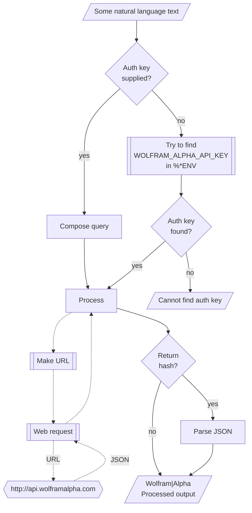

# WWW::WolframAlpha

[](https://github.com/antononcube/Raku-WWW-WolframAlpha/actions/workflows/macos.yml)
[](https://github.com/antononcube/Raku-WWW-WolframAlpha/actions/workflows/linux.yml)
[](https://github.com/antononcube/Raku-WWW-WolframAlpha/actions/workflows/windows.yml)
[](https://raku.land/zef:antononcube/WWW::WolframAlpha)

## In brief

This Raku package provides access to the answer engine [Wolfram|Alpha](https://www.wolframalpha.com), [WA1, Wk1].
For more details of the Wolfram|Alpha's API usage see [the documentation](https://products.wolframalpha.com/api/documentation), [WA2].

**Remark:** To use the Wolfram|Alpha API one has to register and obtain an authorization key.


-----

## Installation

Package installations from both sources use [zef installer](https://github.com/ugexe/zef)
(which should be bundled with the "standard" Rakudo installation file.)

To install the package from [Zef ecosystem](https://raku.land/) use the shell command:

```
zef install WWW::WolframAlpha
```

To install the package from the GitHub repository use the shell command:

```
zef install https://github.com/antononcube/Raku-WWW-WolframAlpha.git
```

----

## Usage examples

**Remark:** When the authorization key, `auth-key`, is specified to be `Whatever`
then the functions `wolfam-alpha*` attempt to use the env variable `WOLFRAM_ALPHA_API_KEY`.

The package has an universal "front-end" function `wolfram-alpha` for the 
[different endpoints provided by Wolfram|Alpha Web API](https://products.wolframalpha.com/api/documentation).

### (Plaintext) results

Here is a _result_ call:

```perl6
use WWW::WolframAlpha;
wolfram-alpha-result('How many calories in 4 servings of potato salad?');
```
```
# about 720 dietary Calories
```

### Simple (image) results

Here is a _simple_ call (produces an image):

```perl6, results=asis
wolfram-alpha-simple('What is popularity of the name Larry?', format => 'md-image');
```

### Full queries

For the so called *full queries* Wolfram|Alpha returns complicated data of pods in either XML or JSON format;
see ["Explanation of Pods"](https://products.wolframalpha.com/api/documentation?scrollTo=explanation-of-pods).

Here we get the result of a full query and show its (complicated) data type (using ["Data::TypeSystem"](https://raku.land/zef:antononcube/Data::TypeSystem)):

```perl6
use Data::TypeSystem;

my $podRes = wolfram-alpha-query('convert 44 lbs to kilograms', output => 'json', format => 'hash');

deduce-type($podRes)
```
```
# Assoc(Atom((Str)), Assoc(Vector(Atom((Str)), 18), Tuple([Atom((Int)) => 4, Atom((Rat)) => 2, Atom((Str)) => 10, Struct([count, template, type, values, word], [Int, Str, Str, Array, Str]) => 1, Tuple([Struct([error, expressiontypes, id, numsubpods, position, scanner, subpods, title], [Bool, Hash, Str, Int, Int, Str, Array, Str]), Struct([error, expressiontypes, id, numsubpods, position, primary, scanner, subpods, title], [Bool, Hash, Str, Int, Int, Bool, Str, Array, Str]), Struct([error, expressiontypes, id, numsubpods, position, scanner, states, subpods, title], [Bool, Array, Str, Int, Int, Str, Array, Array, Str]), Struct([error, expressiontypes, id, numsubpods, position, scanner, subpods, title], [Bool, Hash, Str, Int, Int, Str, Array, Str]), Struct([error, expressiontypes, id, numsubpods, position, scanner, states, subpods, title], [Bool, Hash, Str, Int, Int, Str, Array, Array, Str]), Struct([error, expressiontypes, id, numsubpods, position, scanner, subpods, title], [Bool, Array, Str, Int, Int, Str, Array, Str])]) => 1], 18), 18), 1)
```

Here we convert the query result into Markdown (`data-translation` can be also used):

```perl6, results=asis
wolfram-alpha-pods-to-markdown($podRes, header-level => 4):plaintext;
```
#### Input interpretation

**scanner:** Identity


convert 44 lb (pounds) to kilograms

#### Result

**scanner:** Identity


19.96 kg (kilograms)

#### Additional conversions

**scanner:** Unit


3 stone 2 pounds


19958 grams

#### Comparison as mass

**scanner:** Unit


 ≈ 1.6 × mass of a Good Delivery gold bar ( 400 oz t )

#### Interpretations

**scanner:** Unit


mass

#### Corresponding quantities

**scanner:** Unit


Relativistic energy E from E = mc^2:
 | 1.794×10^18 J (joules)
 | 1.12×10^37 eV (electronvolts)


Weight w of a body from w = mg:
 | 44 lbf (pounds-force)
 | 1.4 slugf (slugs-force)
 | 196 N (newtons)
 | 1.957×10^7 dynes
 | 19958 ponds


Volume V of water from V = m/ρ_(H_2O):
 | 5.3 gallons
 | 42 pints
 | 20 L (liters)
 | 19958 cm^3 (cubic centimeters)
 | (assuming conventional water density ≈ 1000 kg/m^3)


-------

## Command Line Interface

### Playground access

The package provides a Command Line Interface (CLI) script:

```shell
wolfram-alpha --help
```
```
# Usage:
#   wolfram-alpha [<words> ...] [--path=<Str>] [--output-format=<Str>] [-a|--auth-key=<Str>] [--timeout[=UInt]] [-f|--format=<Str>] [--method=<Str>] -- Command given as a sequence of words.
#   
#     --path=<Str>             Path, one of 'result', 'simple', or 'query'. [default: 'result']
#     --output-format=<Str>    The format in which the response is returned. [default: 'Whatever']
#     -a|--auth-key=<Str>      Authorization key (to use WolframAlpha API.) [default: 'Whatever']
#     --timeout[=UInt]         Timeout. [default: 10]
#     -f|--format=<Str>        Format of the result; one of "json", "hash", "values", or "Whatever". [default: 'Whatever']
#     --method=<Str>           Method for the HTTP POST query; one of "tiny" or "curl". [default: 'tiny']
```


**Remark:** When the authorization key argument "auth-key" is specified set to "Whatever"
then `wolfram-alpha` attempts to use the env variable `WOLFRAM_ALPHA_API_KEY`.


--------

## Mermaid diagram

The following flowchart corresponds to the steps in the package function `wolfram-alpha-query`:



--------

## References

[AAp1] Anton Antonov,
[Data::TypeSystem Raku package](https://github.com/antononcube/Raku-Data-TypeSystem),
(2023),
[GitHub/antononcube](https://github.com/antononcube).

[WA1] Wolfram Alpha LLC, [Wolfram|Alpha](https://www.wolframalpha.com). 

[WA2] Wolfram Alpha LLC, [Web API documentation](https://products.wolframalpha.com/api/documentation).

[Wk1] Wikipedia entry, [WolframAlpha](https://en.wikipedia.org/wiki/WolframAlpha).